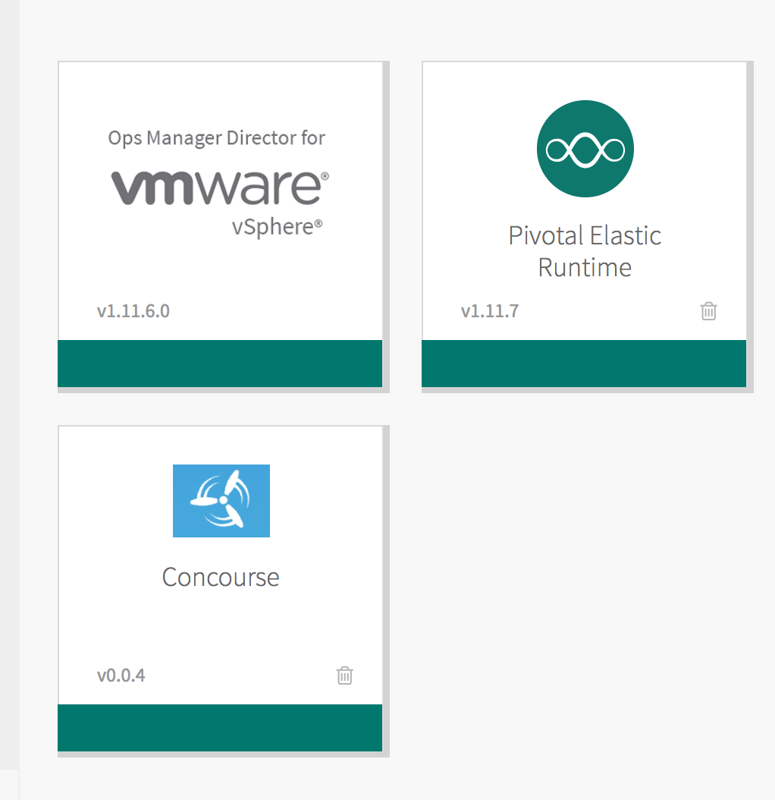
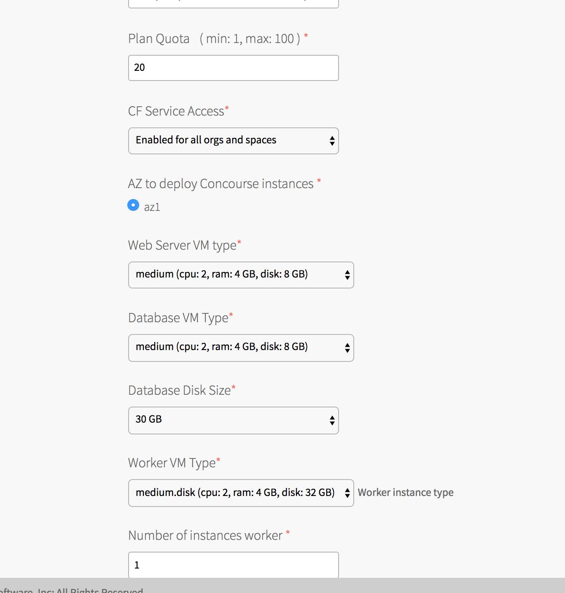

# On Demand concourse tile


## Deploy the concourse tile to pivotal cf (Tile file is accessed by request)



## Configure the plan detail (currently there is only one plan)




## Create a concourse cluster

```
cf marketplace
Getting services from marketplace in org test / space test as admin...
OK

service          plans             description
p.concourse      concourse-small   Concourse service to provide on-demand concourse instance

TIP:  Use 'cf marketplace -s SERVICE' to view descriptions of individual plans of a given service.
```

```
cf create-service p.concourse concourse-small my-concourse
```

A bosh deployment of concourse starts .....

```
cf services
Getting services in org test / space test as admin...
OK

name           service       plan              bound apps   last operation
my-concourse   p.concourse   concourse-small   test         create succeeded
```

It supports static credentials binding

```
cf bind-service test my-concourse
cf env test

"VCAP_SERVICES": {
 "p.concourse": [
  {
   "credentials": {
    "host": "https://service-instance_caf20641-712e-4875-9c4b-72b1abea4465.cfapps.haas-60.pez.pivotal.io",
    "password": "9/eK1xFUqJ+QzHke2xMRHiwpf34=",
    "username": "atc"
   },
```

the tile register the web tier to go router and concourse will be available in https://{bosh_deployment_name}.app_domain
